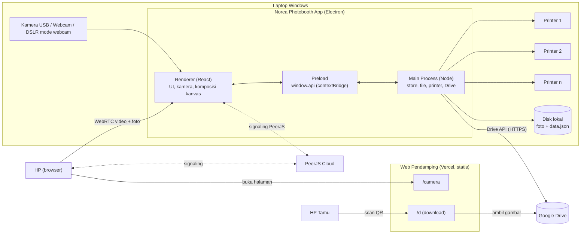
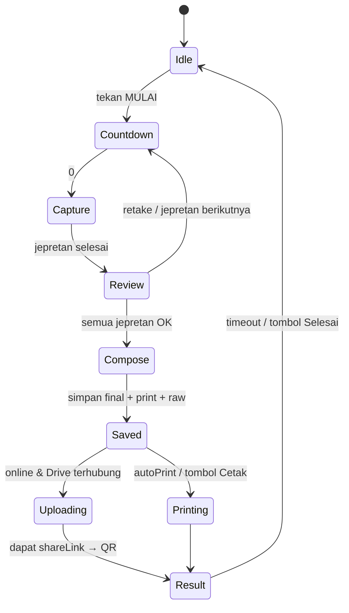
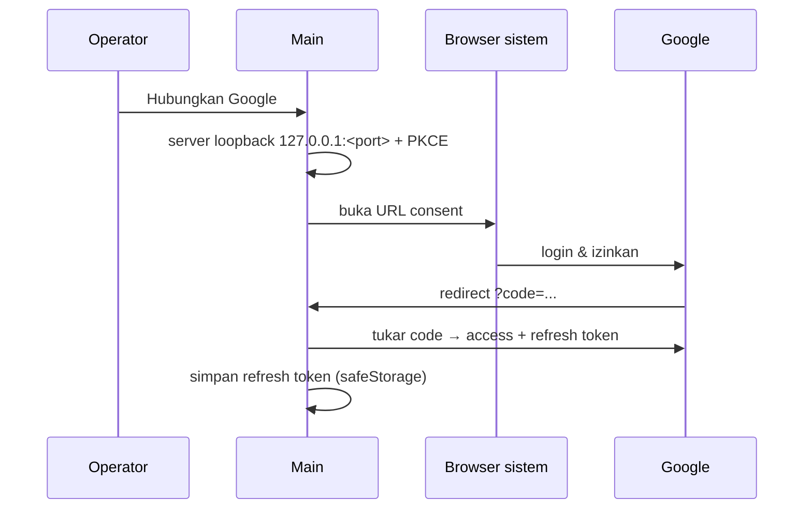

# 02 · Architecture

## Gambaran Besar



## Proses Electron

| Proses | Tanggung jawab | Boleh akses |
|---|---|---|
| **Main** (`src/main`) | Window, penyimpanan data, file foto, custom protocol `norea://`, printer (daftar, status, antrian, print senyap), Google OAuth + upload, antrian offline | Node.js, OS, jaringan |
| **Preload** (`src/preload`) | Mengekspos API aman `window.api` via `contextBridge` | `ipcRenderer` saja |
| **Renderer** (`src/renderer`) | Semua UI, akses kamera (`getUserMedia`), komposisi gambar di `<canvas>`, filter, QR, koneksi kamera HP (PeerJS) | API browser + `window.api` |

Pengaturan keamanan window: `contextIsolation: true`, `nodeIntegration: false`, `sandbox: true`.

## Penyimpanan

```
%APPDATA%/Norea Photobooth App/        (app.getPath('userData'))
├── data.json          settings, events, templates, sessions
└── assets/            gambar template (overlay/background PNG)

Documents/Norea Photobooth/           (settings.saveDir, bisa diganti)
└── <nama-event>_<tanggal>/
    ├── final/         hasil jadi (softcopy) JPG
    ├── print/         file siap cetak (strip digandakan)
    └── raw/           jepretan asli per sesi
```

- `data.json` ditulis **atomik** (tulis ke `.tmp` lalu rename) dan di-debounce.
- Aset & foto disajikan ke renderer lewat protocol `norea://asset/<file>` dan `norea://file/<path>` dengan header CORS, supaya kanvas tidak "tainted".
- Refresh token Google dienkripsi dengan `safeStorage` (DPAPI Windows).

## Model Data

Definisi lengkap ada di [src/shared/types.ts](../src/shared/types.ts). Ringkasan:

- `AppSettings`: PIN (hash), event aktif, kamera, printer, mode print, akun Google, URL web pendamping, folder simpan
- `EventData`: nama, tanggal, info tambahan, `templateId`, `driveFolderUrl`, `SessionSettings`
- `FrameTemplate`: `layoutId`, background, overlay, dekorasi, style foto, `TextElement[]`, posisi QR
- `SessionRecord`: path file, status upload, `driveFileId`, `shareLink`, jumlah cetak
- `PrintJob`: printer tujuan, copy, status

Layout (ukuran & slot foto) didefinisikan di kode `src/shared/layouts.ts`, bukan di data user.

## Alur Satu Sesi



1. **Renderer** menjalankan countdown dan mengambil frame dari video (`<canvas>`). Untuk kamera HP, renderer meminta foto resolusi penuh lewat data channel (fallback: ambil frame video).
2. **Renderer** mengomposisi: background → foto (cover-fit ke slot + filter) → overlay PNG → dekorasi → teks → QR (opsional). Output `finalDataUrl` (softcopy) dan `printDataUrl` (untuk strip: 2 strip berdampingan di 1 lembar 4R).
3. `api.sessions.save()` → **Main** menulis file JPG, membuat `SessionRecord` dengan status upload `pending`.
4. Kalau `autoPrint` aktif → `api.printer.print()`.
5. **Upload worker** di Main mengambil sesi `pending` → upload ke folder Drive event → set permission "anyone with link" → simpan `shareLink` → emit `session:updated`.
6. Renderer menampilkan QR begitu `shareLink` tersedia.

**Kalau offline**: langkah 1–4 tetap jalan. Upload tertahan di antrian dan dicoba ulang tiap 15 detik, atau langsung saat event `online` muncul. Layar hasil menampilkan "Softcopy akan dikirim setelah online".

## Printer

### Deteksi
- Daftar printer: `webContents.getPrintersAsync()`.
- Status & antrian: PowerShell `Get-Printer | Select Name,PrinterStatus,JobCount | ConvertTo-Json`, dipoll tiap 3 detik (satu proses untuk semua printer).
- Printer dianggap **tidak tersedia** kalau statusnya Offline, Error, PaperOut, PaperJam, Paused, atau NotAvailable, atau kalau dimatikan operator.

### Algoritma Pemilihan
```
kandidat = printer yang enabled && available
jika kosong → job status "queued", tunggu printer tersedia
mode least-busy : pilih min(jobCount + inFlight), seri → urutan daftar
mode round-robin: pilih kandidat berikutnya setelah printer terakhir dipakai
```
`inFlight` adalah job dari aplikasi ini yang sudah dikirim tapi belum muncul/lepas dari antrian Windows. Ini menutup jeda karena status Windows sering telat.

> Catatan: status "sedang print" dari driver tidak selalu akurat (tergantung merk). Karena itu antrian dihitung sendiri + operator bisa mematikan printer manual (misal kertas habis).

### Cetak Senyap
Main membuat `BrowserWindow` tersembunyi, memuat HTML berisi gambar dengan `@page { size: W H; margin: 0 }`, lalu `webContents.print({ silent: true, deviceName, copies, margins: { marginType: 'none' }, pageSize: { width, height } })` dalam mikron. Mode `printPaperMode = 'driver'` memakai ukuran kertas default driver.

## Google Drive



- Scope: `https://www.googleapis.com/auth/drive` (dibutuhkan untuk menulis ke folder yang dibuat user, bukan oleh aplikasi).
- Folder ID diambil dari link: `/folders/<id>` atau `?id=<id>`. Aplikasi mengecek akses folder dan menampilkan nama folder saat link di-paste.
- Upload: `POST upload/drive/v3/files?uploadType=multipart&supportsAllDrives=true`, lalu `POST files/<id>/permissions {role: reader, type: anyone}`.
- `shareLink` = `<webBaseUrl>/d/?id=<fileId>&e=<nama-event>`. Kalau `webBaseUrl` kosong, pakai `https://drive.google.com/file/d/<id>/view`.

## Kamera HP (WebRTC)

1. Renderer membuat `Peer` dengan ID acak (`norea-<random>`) di PeerJS Cloud (signaling gratis).
2. Studio menampilkan QR `<webBaseUrl>/camera/?peer=<id>`.
3. HP membuka halaman, meminta izin kamera (HTTPS dari Vercel), lalu `peer.call(id, stream)`.
4. Booth menerima `MediaStream` → dipakai sebagai sumber kamera seperti kamera lain.
5. Saat jepret, booth mengirim `{type:'capture'}` via data connection. HP mengambil foto (`ImageCapture.takePhoto()` atau frame video resolusi penuh) lalu mengirim JPEG biner. Timeout 5 detik → fallback ambil frame dari stream.
6. Satu booth hanya menerima satu HP aktif. Koneksi baru menggantikan yang lama setelah operator setuju.

## Kontrak IPC

Nama channel: `domain:aksi`. Semua via `ipcRenderer.invoke` (request/response), kecuali event push dari Main.

| Channel | Arah | Keterangan |
|---|---|---|
| `state:get` | R→M | Ambil `AppState` |
| `settings:update` | R→M | Update sebagian settings |
| `pin:verify` / `pin:change` | R→M | Verifikasi / ganti PIN |
| `events:save` / `events:delete` / `events:setActive` | R→M | CRUD event |
| `templates:save` / `templates:delete` | R→M | CRUD template |
| `assets:save` | R→M | Simpan data URL PNG → `norea://asset/...` |
| `sessions:save` / `sessions:list` / `sessions:delete` | R→M | Simpan hasil sesi & galeri |
| `printer:list` / `printer:setConfig` / `printer:print` / `printer:test` | R→M | Printer |
| `drive:status` / `drive:connect` / `drive:disconnect` / `drive:checkFolder` / `drive:retry` | R→M | Google Drive |
| `app:openPath` / `app:openExternal` / `app:fullscreen` | R→M | Utilitas |
| `printer:updated` | M→R | Status printer & job |
| `session:updated` | M→R | Status upload / shareLink berubah |
| `drive:updated` | M→R | Status koneksi / antrian |

## Web Pendamping (Vercel)

Situs **statis** di folder `web/`, tanpa backend dan tanpa database:

- `/camera/`: kamera HP (PeerJS dari CDN), pilih kamera depan/belakang, indikator koneksi.
- `/d/?id=...&e=...`: halaman download tamu. Menampilkan foto dari Drive (`drive.google.com/thumbnail?id=...&sz=w2000`) dan tombol download (`drive.google.com/uc?export=download&id=...`), dengan tema Norea.
