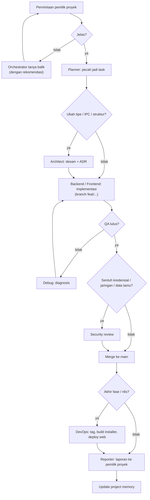

# 15 · Workflow

Alur kerja dari permintaan sampai rilis.

## Siklus Harian

1. Buka [14-project-memory.md](14-project-memory.md) untuk status & keputusan terbaru.
2. Ambil task `todo` teratas dari fase aktif di [20-roadmap.md](20-roadmap.md).
3. Buat branch `feat/<nama>`.
4. Kerjakan → `npm run typecheck` → test.
5. Handoff ke QA (format di [13-agent-communication.md](13-agent-communication.md)).
6. Merge ke `main` setelah lulus.

## Siklus Fase

1. **Kickoff:** Planner memecah fase jadi task, Architect menyiapkan kontrak.
2. **Build:** task dikerjakan (Backend & Frontend paralel kalau kontrak sudah ada).
3. **Stabilisasi:** QA regresi fitur fase itu.
4. **Demo:** Reporter menyiapkan laporan + cara mencoba, lalu pemilik proyek mencoba.
5. **Rilis:** DevOps membuat versi (fase ≥ 2 menghasilkan installer yang bisa dipakai uji coba).

## Kapan Wajib Bertanya ke Pemilik Proyek

- Menambah/mengubah fitur yang dilihat tamu
- Mengubah alur sesi foto
- Memakai layanan berbayar (API AI, TURN server, code signing)
- Apa pun yang menyentuh akun (GitHub, Vercel, Google)
